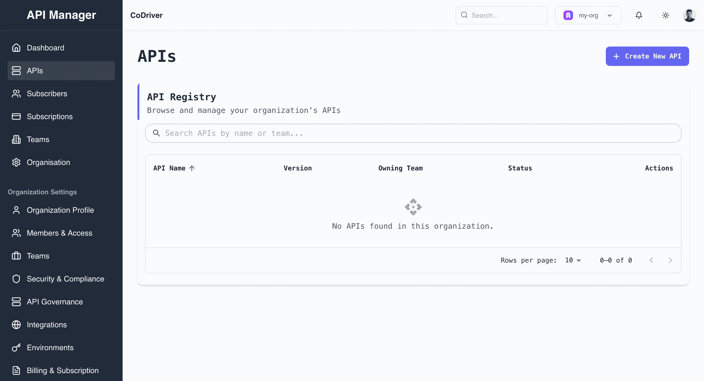
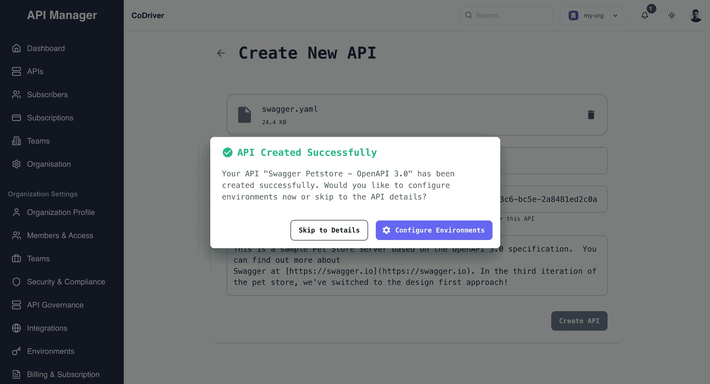

# API Management Guide

## 📌 Registering APIs

### Prerequisites
- OpenAPI/Swagger specification file (OpenAPI 3.0 format required)
- Team ID for API assignment
- Appropriate permissions in the organization

### Step-by-Step Guide

#### 1. Access the API Registry
- Navigate to the `APIs` section in the left sidebar
- Click the `Create New API` button in the top-right corner
- The API Registry displays all registered APIs in your organization with their versions, owning teams, and status

#### 2. Create New API
- Upload your OpenAPI specification file (supported format: YAML)
- The system will automatically populate fields based on your specification.
- Enter/Select the Team ID for API ownership

> **Important**: The specification file must be in OpenAPI 3.0 format. Swagger 2.0 specifications will not be accepted.

#### 3. Confirm API Creation
After successful validation and creation, you'll see two options:
- `Configure Environments`: Set up different [environments](../quickstarts/environments.md) for your API
- `Skip to Details`: Proceed directly to the API overview page

#### 4. View API Details

>  **Best Practices**:
>   - Use meaningful API names and descriptions
>   - Include comprehensive API documentation
>   - Set up proper versioning
>   - Configure all necessary environments before sharing with subscribers

## 🔑 Managing API Access

Control and secure your API access:

1. **Authentication Methods**
   - API Key authentication
   - OAuth 2.0 integration
   - JWT token validation
   - Custom authentication schemes

2. **Access Control Policies**
   - IP address restrictions
   - Rate limiting rules
   - Request quotas
   - Time-based access controls

3. **Security Best Practices**
   - Implement HTTPS
   - Regular key rotation
   - Monitor access patterns
   - Set up alerts for suspicious activity

[SCREENSHOT: API Access Settings]

## 🚀 API Versioning

Manage your API versions effectively:

1. **Version Creation**
   - Create new versions from existing APIs
   - Specify version numbers (e.g., v1, v2)
   - Update API specifications
   - Configure version-specific settings

2. **Version Lifecycle**
   - Draft: Initial development
   - Published: Available for use
   - Deprecated: Scheduled for removal
   - Retired: No longer supported

3. **Version Management**
   - Set default versions
   - Configure version transitions
   - Manage backward compatibility
   - Plan deprecation schedules

[SCREENSHOT: API Version Management]

## Next Steps

After setting up your API, you can:
- [Configure Subscriptions](../subscription.md)
- [Set Up SDK Integration](../sdk-usage.md)
- [Monitor API Analytics](../analytics.md)
